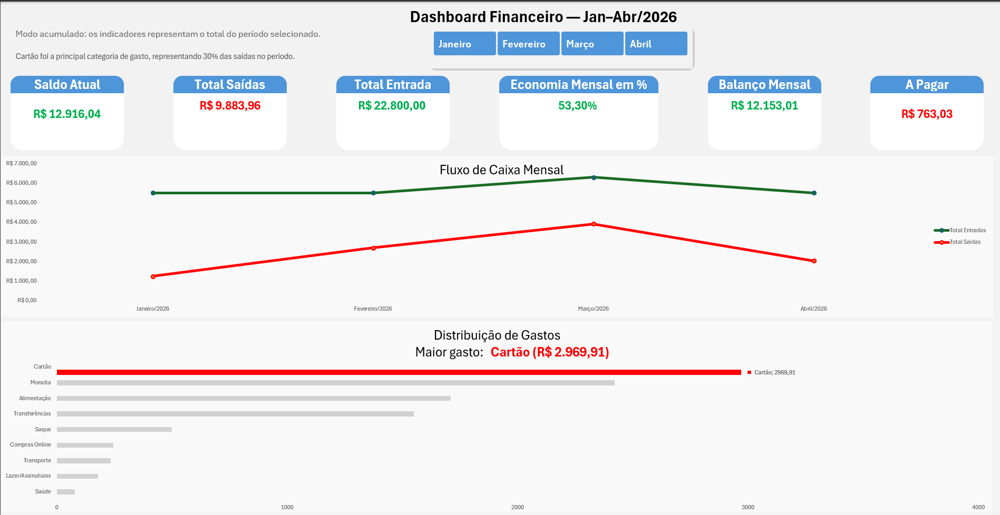
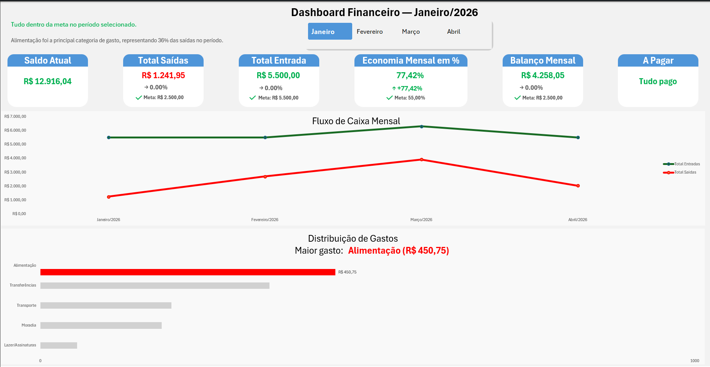
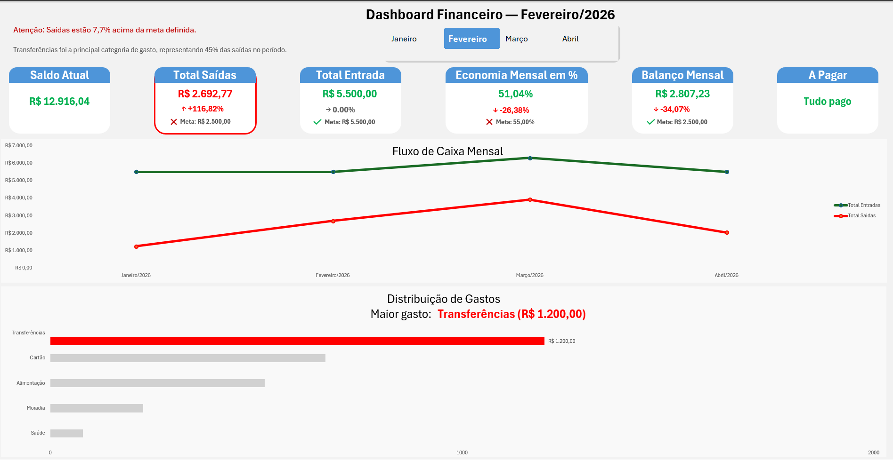
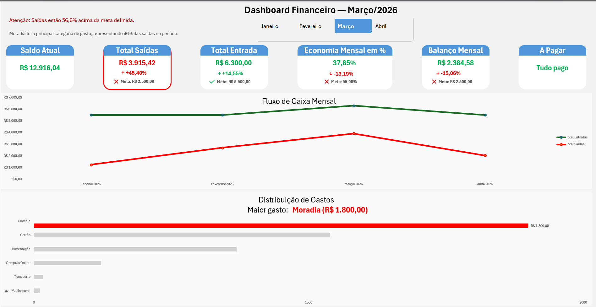
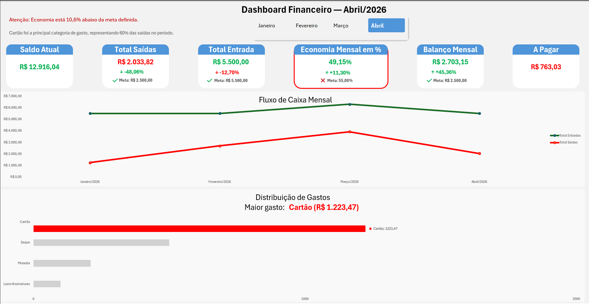
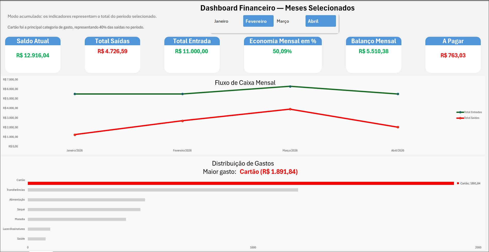

# 📊 Financial Dashboard in Excel

## 📌 Project Overview

This project consists of an interactive financial dashboard developed in Excel, designed to provide clear visibility into financial data such as income, expenses, and balance.

The goal is to support decision-making through dynamic visualizations and automated indicators.

---

## 🎯 Objective

To create a user-friendly dashboard that allows:

- Monitoring financial performance over time
- Comparing monthly results
- Identifying trends in income and expenses
- Simplifying financial analysis

---

## ⚙️ Features

- 📌 Key Performance Indicators (KPIs)
  - Total Income
  - Total Expenses
  - Current Balance
  - Month-over-Month variation (MoM)

- 📊 Interactive Charts
  - Financial trends over time
  - Category breakdown
  - Comparative analysis

- 🎛️ Dynamic Filters
  - Time-based filtering (Month/Year)
  - Interactive slicers connected to all visuals

- ⚡ Automation
  - Automated KPI updates
  - VBA used for dynamic card formatting and visual feedback

- 🔒 User Experience & Protection
  - Internal sheets (data and calculations) are protected
  - Only the **Dashboard** sheet is accessible to the user
  - Designed to prevent accidental modifications
  - Focus on a clean and guided user interaction

---

## 🛠️ Tools & Technologies

- Microsoft Excel
- Pivot Tables
- Slicers
- Data Modeling
- VBA (Visual Basic for Applications)

---

## 🧠 Design Decisions

- Separation between data layer and dashboard layer (Resumo vs Dashboard)
- Protection of internal structures to ensure data integrity
- Focus on clarity and quick readability
- Use of minimalistic layout for better user experience
- Highlighting key metrics for fast decision-making

---

## 📈 Results

This dashboard enables users to:

- Quickly understand financial health
- Track performance changes over time
- Make data-driven financial decisions
- Reduce manual analysis effort

---

## 📸 Preview

### Dashboard Overview

### KPI Analysis (January)

### KPI Analysis (February)

### KPI Analysis (March)

### KPI Analysis (April)

### Flexible Time Filtering (Non-Continuous Months)
Allows users to select multiple non-sequential months, enabling customized comparative analysis.

---

## 🎥 Demo

---

## 🚀 Future Improvements

- Integration with Power Query for automated data updates
- Expansion of KPI metrics
- Migration to Power BI for scalability

---

## 📬 Contact

Feel free to connect with me:

- LinkedIn: [https://www.linkedin.com/in/felipemendessantos/](https://www.linkedin.com/in/felipemendessantos/)
- GitHub: https://github.com/Felipee-M